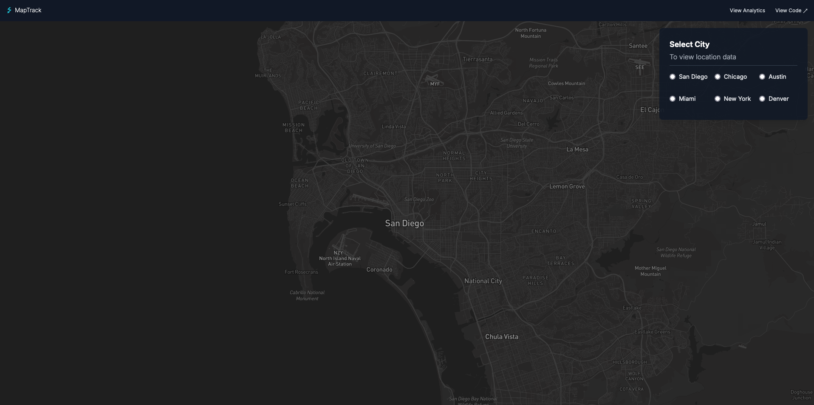
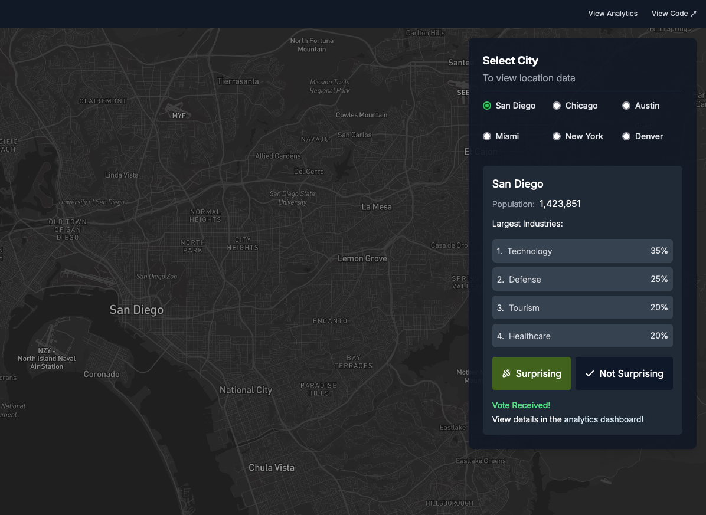

## Demo Mapping App 

This app uses Next.js and React-Map-GL, and tracks events in Mixpanel.

Link: 
https://mixpanel-map-app.onrender.com/

>Please allow up to 30 seconds for the site to load. It's hosted on Render for free, and may not load immediately due to load balancing. 

## Functionality 

**1. Landing Page**  

- The map displays San Diego on initial page load.   

- Click on a city to view its data.  
  

---  

  

**2. Vote Buttons**

- Click the `surprising` or `not surprising` buttons to indicate if the data is surprising to you.  
- After making a selection, a message will appear inviting you to view the analytics data in Mixpanel, which is also accessible [here](https://mixpanel.com/public/MJPKgaGaHdP8GKRCikSZwd).    

---
    

  

  

  

  

    
     

  
## Housekeeping
> This project is using client-side tracking so if you're using ad-blockers you may not see your page visits being tracked.   
> 
 Most of the analytics data (at present) is from testing the application. 
